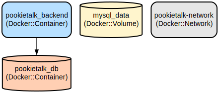

# PookieTalk - A Real-Time Chat Application with Secure Authentication

PookieTalk is a modern, secure chat application that enables real-time communication between users through a web interface. Built with Spring Boot and React, it provides seamless messaging capabilities with JWT-based authentication and WebSocket integration for instant message delivery.

The application features a robust backend architecture with Spring Security for authentication, WebSocket support for real-time messaging, and a responsive React frontend with TypeScript. It includes user management, private messaging, and persistent chat history stored in MySQL database. The application is containerized using Docker for easy deployment and scalability.

## Repository Structure
```
.
├── backend/                      # Spring Boot backend application
│   ├── src/                     # Source code directory
│   │   ├── main/               # Main application code
│   │   │   ├── java/com/pookietalk/
│   │   │   │   ├── config/    # Application configuration classes
│   │   │   │   │   ├── CorsConfig.java        # CORS settings
│   │   │   │   │   ├── JwtAuthFilter.java     # JWT authentication
│   │   │   │   │   ├── SecurityConfig.java    # Security settings
│   │   │   │   │   └── WebSocketConfig.java   # WebSocket setup
│   │   │   │   ├── controllers/  # REST API endpoints
│   │   │   │   │   ├── AuthController.java    # Authentication
│   │   │   │   │   ├── ChatController.java    # Chat management
│   │   │   │   │   ├── MessageController.java # Message handling
│   │   │   │   │   └── UserController.java    # User management
│   │   │   │   ├── dto/         # Data Transfer Objects
│   │   │   │   ├── exceptions/  # Custom exceptions
│   │   │   │   ├── models/      # Database entities
│   │   │   │   ├── repositories/# Data access layer
│   │   │   │   └── services/    # Business logic
│   │   │   ├── resources/     # Application properties
│   │   │   └── docker/        # Docker configuration
│   │   └── test/              # Test cases
│   └── pom.xml                # Maven configuration
└── frontend/                    # React frontend application
    ├── src/                    # Source code directory
    │   ├── components/        # Reusable UI components
    │   │   ├── ChatBox.tsx   # Chat display component
    │   │   ├── Footer.tsx    # Application footer
    │   │   ├── Header.tsx    # Application header
    │   │   ├── InputField.tsx# Reusable input component
    │   │   ├── MessageBubble.tsx # Message display
    │   │   ├── Navbar.tsx    # Navigation component
    │   │   ├── Sidebar.tsx   # Side navigation
    │   │   └── UserList.tsx  # User listing component
    │   ├── context/          # React context providers
    │   │   ├── AuthContext.tsx # Authentication state
    │   │   └── ChatContext.tsx # Chat state management
    │   ├── hooks/            # Custom React hooks
    │   │   ├── useAuth.ts    # Authentication hook
    │   │   └── useChat.ts    # Chat functionality hook
    │   ├── pages/            # Application pages
    │   │   ├── ChatRoom.tsx  # Main chat interface
    │   │   ├── Login.tsx     # Login page
    │   │   ├── Profile.tsx   # User profile
    │   │   └── Register.tsx  # Registration page
    │   ├── services/         # API integration
    │   │   ├── authService.ts # Auth API calls
    │   │   ├── chatService.ts # Chat API calls
    │   │   └── socketService.ts # WebSocket handling
    │   └── utils/            # Utility functions
    ├── package.json          # NPM configuration
    ├── tsconfig.json        # TypeScript configuration
    └── vite.config.ts       # Vite build configuration
├── docs/                     # Documentation
│   ├── infra.dot           # Infrastructure diagram source
│   └── infra.svg           # Infrastructure diagram
└── docker-compose.yml       # Main Docker composition
```

## Usage Instructions
### Prerequisites
- Java Development Kit (JDK) 21
- Node.js 16.x or higher
- MySQL 8.3
- Docker and Docker Compose (optional)

### Installation

#### Backend Setup
1. Configure MySQL database:
```bash
mysql -u root -p
CREATE DATABASE pookietalk;
```

2. Build and run the backend:
```bash
cd backend
./mvnw clean install
./mvnw spring-boot:run
```

#### Frontend Setup
1. Install dependencies:
```bash
cd frontend
npm install
```

2. Start the development server:
```bash
npm run dev
```

### Quick Start
1. Access the application at `http://localhost:5173`
2. Register a new account or login with existing credentials
3. Start chatting with other users in real-time

### More Detailed Examples
#### Sending Messages
```typescript
// Using the chat service
const sendMessage = async (content: string) => {
  await chatService.sendMessage(user.email, content);
};
```

#### WebSocket Connection
```typescript
// Connecting to WebSocket
socketService.connect();
socketService.onMessage((message) => {
  // Handle incoming message
});
```

### Troubleshooting
#### Common Issues
1. Database Connection Issues
   - Error: `Unable to connect to MySQL database`
   - Solution: Verify MySQL is running and credentials are correct in `application.yml`

2. WebSocket Connection Failed
   - Error: `WebSocket connection failed`
   - Check CORS configuration in `WebSocketConfig.java`
   - Verify the WebSocket endpoint URL matches in frontend configuration

#### Debugging
- Enable debug logs in `application.yml`:
```yaml
logging:
  level:
    com.pookietalk: DEBUG
```
- Check application logs in `backend/logs/`
- Frontend console logs in browser developer tools

## Data Flow
The application follows a client-server architecture with WebSocket integration for real-time messaging.

```ascii
Client (React) <---> API Gateway (Spring) <---> Business Logic <---> Database
     ^                                              ^
     |                                              |
     +-------------- WebSocket Server --------------+
```

Component interactions:
1. Client authenticates using JWT tokens
2. Authenticated clients establish WebSocket connection
3. Messages are sent through REST API and WebSocket
4. Server validates and persists messages
5. Recipients receive messages via WebSocket
6. Chat history is stored in MySQL database

## Infrastructure


### Docker Resources
- MySQL Database Container:
  - Image: mysql:8.0
  - Container name: pookietalk_db
  - Exposed port: 3306
  - Persistent volume: mysql_data

- Backend Application Container:
  - Custom image built from Dockerfile
  - Container name: pookietalk_backend
  - Exposed port: 8080
  - Dependencies: MySQL container

### Network Configuration
- Network: pookietalk-network (bridge)
- Internal communication between containers
- Exposed ports for external access

## Deployment
1. Build Docker images:
```bash
docker-compose build
```

2. Start the application:
```bash
docker-compose up -d
```

3. Monitor logs:
```bash
docker-compose logs -f
```